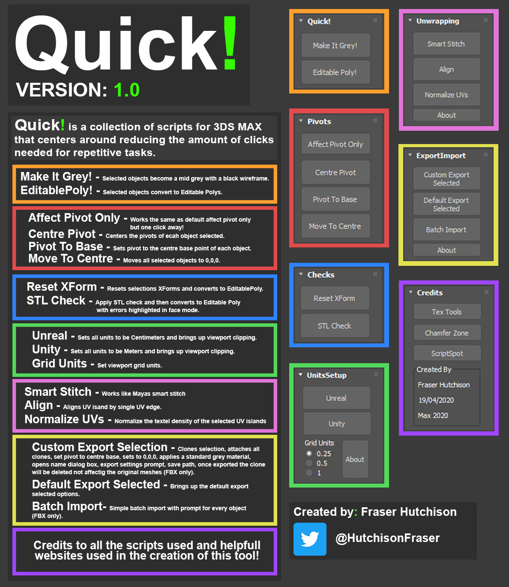

# Quick-3DsMAX-Script
You only need Quick!_V1 if you just want the Quick! (QuickTools) 3DS MAX script

Quick! is a collection of scripts for 3DS MAX that centres around reducing the amount of clicks needed for repetitive tasks.
(Please keep in mind that there may be bugs I dont know about so if you find any let me know!)
---------------------------------------------------------------------------------------------------------------------

[Quick! (QuickTools)]

(Containing scripts made by myself and also other people, to find out more go to the credits menu)

Compiled/Created by Fraser Hutchison

Email: Fraserjameshutchison@gmail.com

Version 0.1

TestedOn: 3DS MAX 2020

Initial Creation Date = 19/04/2020

---------------------------------------------------------------------------------------------------------------------

	!!!![ALWAYS make sure there is only 1 QuickTools macro under> \Users\(your user name)\AppData\Local\Autodesk\3dsMax\2020 - 64bit\ENU\usermacros]!!!! 
	
---------------------------------------------------------------------------------------------------------------------
[HOW TO INSTALL/USE:]

(If you have not installed Quick! before, skip to step 5!)

Download the latest version by going to the GitHub "Tags" panel and download the induvidual .mcr file.

1. Make sure 3DS MAX is closed!

2. Go to C:\Users\(Your User Name)\AppData\Local\Autodesk\3dsMax\2020 - 64bit\ENU\usermacros

3. Make sure there are no existing "QuickTools" Macros in there.

4. Open 3DS MAX

5. Scripting > Run Script... (Find where you have downloaded the Quick! (compiled)Script)

6. Go to the KEYBOARD SHORTCUTS menu (I haven't include the exact path as versions differ) 

7. Search for Quick Or QuickTools and assign a key OR add it as a toolbar button (I have mine to O)

8. SAVE YOUR SHORCUT (I have mine saved in DOCUMENTS but it can be wherever)

9. Click *Your Custom Shortcut* and you're good to go!  
	9.A: To move the UI around it's the small box to the left of the 3DS MAX ICON (this will be changed in future updates)

---------------------------------------------------------------------------------------------------------------------
[ISSUES AND CONTACT INFO:]

Twitter: @HutchisonFraser 
Email: Fraserjameshutchison@gmail.com

"Feel free to contact me about any issues, however I may not always be able to solve them.
If you want to try and fix any issues feel free."

NOTE: "This is a compiled version, the original version is split into many separate scripts to make it easier for development and makes use of the *include* construct. I tried to make a .mzp version however it has proven to be a real pain and for now I have not bothered as the compiled one works just fine. PLEASE READ the .ReadMe in the uncompiled scripts if you are going to use them"

---------------------------------------------------------------------------------------------------------------------
[BUGS]

	1. BatchImport = If you open BatchImport then close it, you will get an error and the MaxScript Editor will appear
--Solution for now: close the MaxScript Editor and also CustomTools, then you are free to open it again using your custom shortcut.

	2.Smart Stitch = Sometimes the smart stitch doesn't work the best, I am unsure why. For the most part is works fine.
--Solution: N/A for now

	3.How to move UI = Not so much a bug but to move the UI you have to click the small gap next to the 3DS MAX button. Im gonna try and fix this in another update.
--Solution: N/A for now

	4.Custom Batch Export doesnt currently work!
--Solution: N/A for now

---------------------------------------------------------------------------------------------------------------------
[CREDITS:]

SMART STITCH: = 
  SMART STITCH (Edited - Removed Functions)
  https://drive.google.com/drive/folders/0B0rKo4v9JhvgNzFGMGU3RmhBcjg
  https://www.youtube.com/watch?v=BbZ7ip-eCcI
  Creator: Chamfer Zone - Tim Bergholz
 
NORMALIZE UVs: =
	  original script by PAUL GREVESON
		http://www.greveson.co.uk/scripts/normalizeUvScale.ms
	THEN >
		TEX TOOLS 
		http://www.scriptspot.com/3ds-max/scripts/textools-toolbox-for-the-texture-artist
		http://renderhjs.net/textools/3dsMax.html
 
ALIGN: = 
 	 TEX TOOLS 
		  http://www.scriptspot.com/3ds-max/scripts/textools-toolbox-for-the-texture-artist
		  http://renderhjs.net/textools/3dsMax.html
    
MAKE IT GREY!: =
 	 Creator: Hosein Afshar : http://www.scriptspot.com/3ds-max/scripts/make-it-gray-please
  
SCRIPT SPOT: = 
	For everything MAX Script related : http://www.scriptspot.com/
