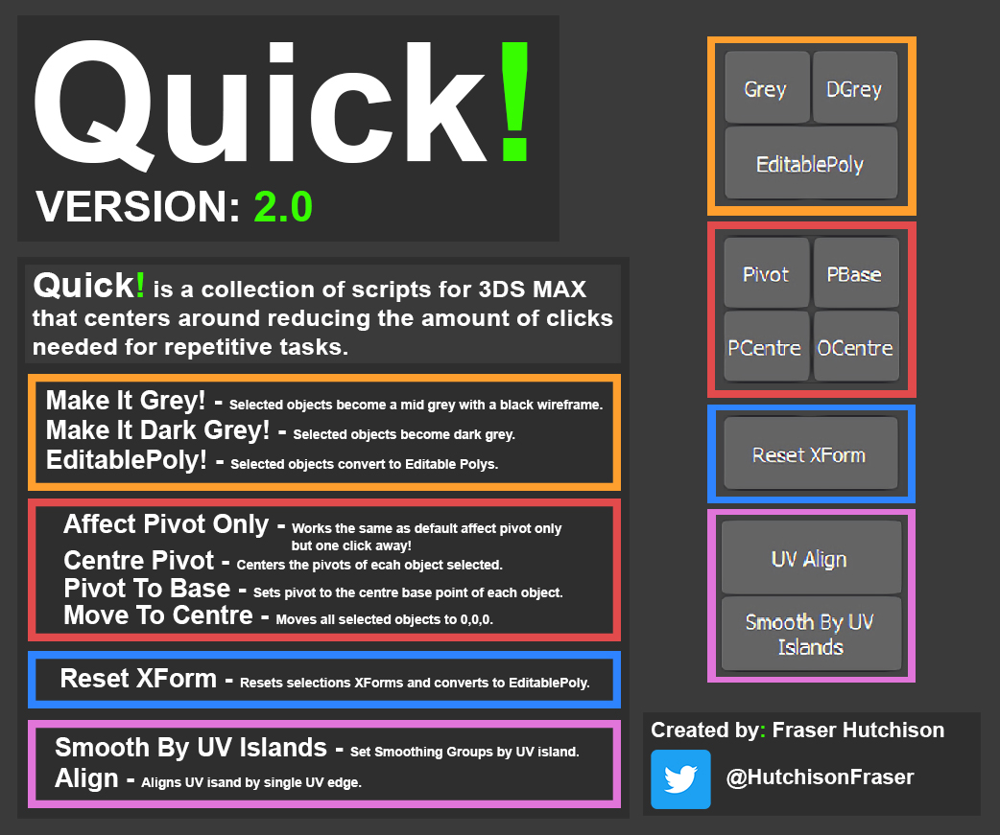

# Quick-3DsMAX-Script

---------------------------------------------------------------------------------------------------------------------

Version 2.0

TestedOn: 3DS MAX 2019/20

---------------------------------------------------------------------------------------------------------------------
[HOW TO INSTALL:]

1. Find the lastest release (right side of screen) and download the Quick.MZP.

2. Drag and drop the .mzp file into the 3DS Max viewport to install.

    ***If you have the old version of Quick!, Restart 3DS Max once the new version is installed, before setting a keyboard shortcut***

3. To set a shortcut go to: Customize> Customize User Interface> Keyboard> Category> Quick!

---------------------------------------------------------------------------------------------------------------------

[ISSUES AND CONTACT INFO:]

Twitter: @HutchisonFraser 

Email: Fraserjameshutchison@gmail.com

"Feel free to contact me about any issues, however I may not always be able to solve them.
If you want to try and fix any issues feel free."

---------------------------------------------------------------------------------------------------------------------
